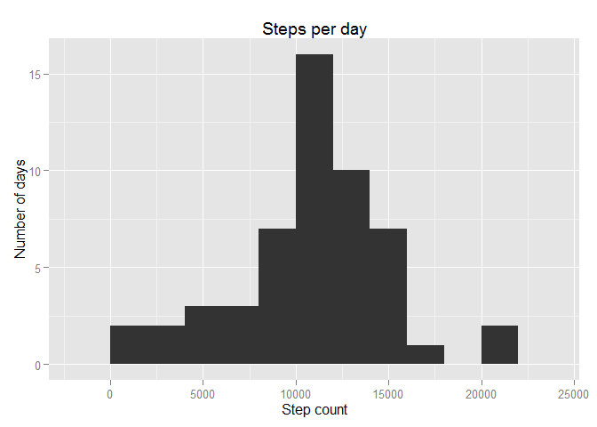
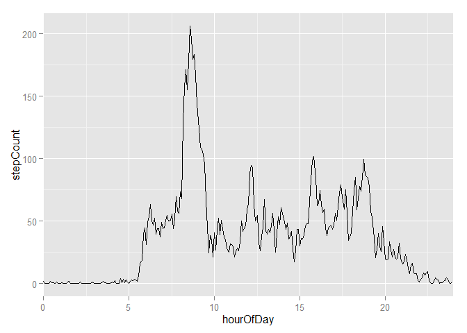
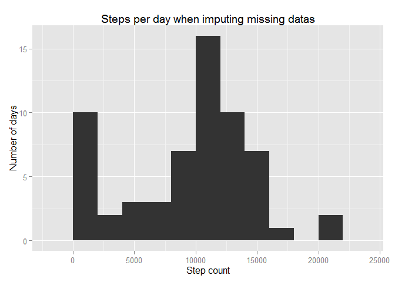

# Reproducible Research: Peer Assessment 1


## Loading and preprocessing the data

We first load a few library to make the work easier.

Lubridate makes parsing and handlign dates and time easier.

Dplyr makes querying and summarising data eaier.

Data.table makes it easy to make lookups in a data set through the key functionality.

Ggplot2 is used to make the graphics in this document.


```r
library(lubridate)
library(dplyr)
library(ggplot2)
library(data.table)
```

The raw activity data is loaded. A calculated column minutesFromMidnight is then added based on the interval name. This is done to make time series treatment of the data easier and plots of the data with correct spacing between points.


```r
unzip("activity.zip")
activityRaw <- read.csv("activity.csv",stringsAsFactors=FALSE)

intervalToMinutes<-function(interval)
{
  hourPart<-floor(interval/100)
  minutePart<-interval-hourPart*100
  hourPart*60+minutePart
}
activity <- activityRaw %>% 
            mutate(date2=ymd(date),minutesFromMidnight=intervalToMinutes(interval))
```

## What is mean total number of steps taken per day?

We create summary statistics from the interval data, first ignoring NA values

```r
stepStats<-activity %>% 
           filter(!is.na(steps)) %>%
           group_by(date) %>% 
           summarise(countPerDay=sum(steps))
```

### Histogram of  total number of steps taken each day
Using this summary we can get a feeling for the distribution of total number of steps per day using a histogram

```r
qplot(stepStats$countPerDay, binwidth=2000,main="Steps per day",xlab="Step count",ylab="Number of days")
```

 

### The mean and median number of steps taken each day
The distribution appears to be mostly symmetrical. This is backed up by the fact the mean number of steps each day and 
median number of steps each day are very similar.


```r
mean(stepStats$countPerDay)
```

```
## [1] 10766.19
```

```r
median(stepStats$countPerDay)
```

```
## [1] 10765
```


## What is the average daily activity pattern?

We can calculate the average step count by grouping together intervals with the same number of minutes from midnight 
and calculating the average. We plot this as a time series graph where the time axis (x axis) has been scaled to hours from midnight 
to make it easier to understand.

```r
intervalStats<-activity %>% 
               filter(!is.na(steps)) %>%
               group_by(minutesFromMidnight) %>%
               summarise(stepCount=mean(steps),intervalMedian=median(steps)) %>%
               mutate(hourOfDay=minutesFromMidnight/60)
```

### Time series plot of the average number of steps taken versus the 5-minute intervals


```r
qplot(hourOfDay,stepCount,data=intervalStats,geom="line")+coord_cartesian(xlim = c(0, 24))
```

 

### 5-minute interval that, on average, contains the maximum number of steps

As can be seen from the graph the interval that has the highes number of steps on the average over all days can be found by


```r
maxStepInt<-intervalStats[which.max(intervalStats$stepCount),]
hr<-floor(maxStepInt$hourOfDay)
mn<-maxStepInt$minutesFromMidnight-60*hr
sprintf("%d:%d",hr,mn)
```

```
## [1] "8:35"
```

## Imputing missing values

There are missing values for the steps measurement in the activity data set

```r
summary(activity)
```

```
##      steps            date              interval          date2           
##  Min.   :  0.00   Length:17568       Min.   :   0.0   Min.   :2012-10-01  
##  1st Qu.:  0.00   Class :character   1st Qu.: 588.8   1st Qu.:2012-10-16  
##  Median :  0.00   Mode  :character   Median :1177.5   Median :2012-10-31  
##  Mean   : 37.38                      Mean   :1177.5   Mean   :2012-10-31  
##  3rd Qu.: 12.00                      3rd Qu.:1766.2   3rd Qu.:2012-11-15  
##  Max.   :806.00                      Max.   :2355.0   Max.   :2012-11-30  
##  NA's   :2304                                                             
##  minutesFromMidnight
##  Min.   :   0.0     
##  1st Qu.: 358.8     
##  Median : 717.5     
##  Mean   : 717.5     
##  3rd Qu.:1076.2     
##  Max.   :1435.0     
## 
```
The number of observations with missing steps is 2304 which is a significant part of the observations or 
13.1147541%

### Strategy for dealing with missing data

We'll impute these missing values by replacing them with the median from the same interval in other days

```r
interval2Steps<-data.table(intervalStats)
activityImputed<-activity
missingIdx<-which(is.na(activity$steps))
activityImputed[missingIdx,1]<-interval2Steps[minutesFromMidnight==activity[missingIdx,]$minutesFromMidnight]$intervalMedian
```

### Influence of imputing data

We can repeat the calculations from question 1 to see the influence on the distribution, mean and meadian of number of steps for each interval 

```r
stepStatsImputed<-activityImputed %>% 
                  filter(!is.na(steps)) %>%
                  group_by(date) %>% 
                  summarise(countPerDay=sum(steps))

list(rawMean=mean(stepStats$countPerDay), imputedMean=mean(stepStatsImputed$countPerDay))
```

```
## $rawMean
## [1] 10766.19
## 
## $imputedMean
## [1] 9503.869
```

```r
list(rawMedian=median(stepStats$countPerDay), imputedMedia=median(stepStatsImputed$countPerDay))
```

```
## $rawMedian
## [1] 10765
## 
## $imputedMedia
## [1] 10395
```

```r
qplot(stepStatsImputed$countPerDay, binwidth=2000,,main="Steps per day when imputing missing datas",xlab="Step count",ylab="Number of days")
```

 


## Are there differences in activity patterns between weekdays and weekends?

It is easy to investigate the difference in activity on weekdays and weekends by adding a factor variable to the dataset indicating if a given day is a "weekend" or "weekday". The wday() function from lubridate helps with that. We can then group by this new factor and summarise the mean number of step for each 5-minute interval on weekends and weekdays.


```r
weekStats <-     activityImputed %>% 
                 mutate(isWeekday=as.factor(ifelse((wday(date2)==1)|(wday(date2)==7),"weekend","weekdays"))) %>%
                 group_by(minutesFromMidnight, isWeekday) %>%
                 summarise(steps=mean(steps)) %>%
                 mutate(hourOfDay=minutesFromMidnight/60)
```

### Comparing the average number of steps taken per 5-minute interval across weekdays and weekends

We plot this on a two panel plot for easy comparison


```r
ggplot(weekStats,aes(hourOfDay,steps))+geom_line()+facet_grid(isWeekday~.)+coord_cartesian(xlim = c(0, 24)) 
```

 

